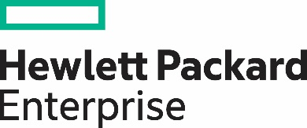
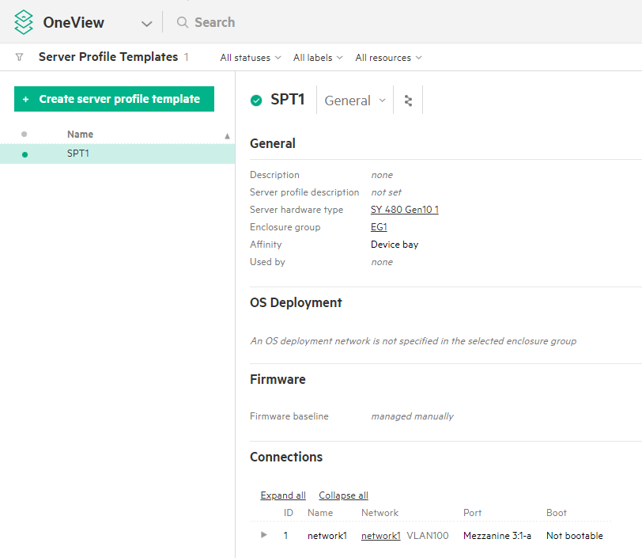
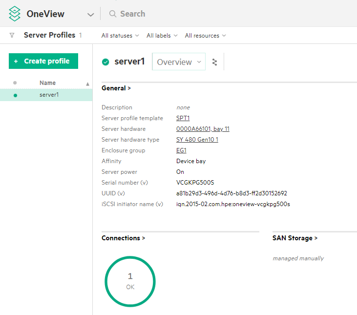

# Infrastructure as code with HPE OneView and Ansible by Red Hat

- [Infrastructure as code with HPE OneView and Ansible by Red Hat](#infrastructure-as-code-with-hpe-oneview-and-ansible-by-red-hat)
  - [Introduction](#introduction)
  - [Setup](#setup)
    - [Configuring the lab](#configuring-the-lab)
  - [HPE OneView essentials](#hpe-oneview-essentials)
  - [Infrastructure as code example](#infrastructure-as-code-example)
    - [Create the server profile template](#create-the-server-profile-template)
    - [Create and apply the server profile](#create-and-apply-the-server-profile)
    - [Clean up](#clean-up)
    - [Conclusion](#conclusion)
  - [Resources, contacts, or additional links](#resources-contacts-or-additional-links)

## Introduction

In this lab you will learn how to automate HPE OneView by using Ansible playbooks. The contents of this lab are published on GitHub: [bobfraser1/infrastructure-as-code-lab](https://github.com/bobfraser1/infrastructure-as-code-lab). This will give you an easy way to read the code as you follow the guide. You can even clone the project to your own laptop.

A whitepaper and accompanying [GitHub repository](https://github.com/HewlettPackard/oneview-ansible-samples) are meant to assist customers and partners in provisioning physical infrastructure, under management by [HPE OneView](https://hpe.com/info/oneview), using [Ansible](https://www.ansible.com/) playbooks. These playbooks then can be checked into source control (eg. git) allowing you to treat infrastructure as code.

Benefits of this infrastructure as code approach include, complete datacenter automation, consistent reproducibility, versioning, and roll back.

## Setup

You have received a team number from 1 to 30. You will use your team number to access resources unique to your team. The first step is to log into the debian instance:

Each one of you will have a unique login which uses the two digits of your team number. ssh to the debian server:

```bash
ssh userXX@debian.lj.lab
```

Where XX is replaced by your team number. Team 1-9 use 00, 01, 02, etc.

Run the ssh command now. The password is password. You are now in a bash shell. The next step is to run a Docker container which contains the lab already set up. Run the following command:

```bash
docker run -it --rm -v lab:/lab bobfraser1/infrastructure-as-code-lab /bin/bash
```

The arguments run the container in interactive mode (-it), remove the container on exit (--rm), mount the Docker volume `lab` at the mount point `/lab`. You are now in a bash shell in the container. The next step is to configure the lab so you get your own dedicated resources.

### Configuring the lab

You will copy two configuration files, one for HPE OneView configuration and one to describe the hardware. First copy the OneView configuration file:

```bash
cp /lab/config/oneview-config-X.json oneview-config.json
```

Where X is replaced by the first digit of your team number.

Next you will copy a hardware configuration file:

```bash
cp /lab/config/infrastructure-config-X.yml infrastructure-config.yml
```

Where X is replaced by the last digit of your team number.

Copy your hardware config file. Check the files `oneview-config.json` and `infrastructure-config.yml`. You can use `cat`, `vim` or `nano`. Your lab is now configured.

Finally, launch a browser and log into OneView:

- Team 1-10 will use dcs-1.lj.lab
- Team 10-20 will use dcs-2.lj.lab
- Team 20-30 will use dcs-3.lj.lab

Use the credentials user:administrator and password:password. When you run the Ansible playbooks, you can see the results in HPE OneView.

You are now ready to run the lab.

## HPE OneView essentials

HPE OneView provides software-defined resources, including templates, profiles, and groups that provide an innovative way to manage the entire data center. These logical constructs let an application or IT organization compose compute, networking, and storage into configurations that are specific to the desired workloads or applications.

Server profiles templates enable you to provision bare metal infrastructure quickly and consistently. Server Profile Templates can be used to
capture best practices once, and then roll them out multiple times in an efficient and error-free way.
A server profile template captures key aspects of a server configuration in one place, including:

- BIOS settings
- Boot order configuration
- Unique IDs such as MAC addresses
- Firmware update selection and scheduling
- OS deployment settings
- Local storage and SAN storage
- Local RAID configuration
- Network connectivity

## Infrastructure as code example

This example will configure a hardware server with boot settings and a network connection, then boot the server.

### Create the server profile template

The playbook [`server_profile_template.yml`](https://github.com/HewlettPackard/oneview-ansible-samples/blob/master/infrastructure-as-code/server_profile_template.yml) will create the server profile template.

Run the command:

```bash
ansible-playbook -i hosts server_profile_template.yml
```

After the server profile template is created, the playbook returns information about the created resource. You can also see the result of the template creation in OneView.

Server profile template



### Create and apply the server profile

Now that we have a server profile template, we can run [`server-profile.yml`](https://github.com/HewlettPackard/oneview-ansible-samples/blob/master/infrastructure-as-code/server_profile.yml) which will create a server profile and assign it to specific server which will configure the hardware. Then the playbook will boot the server.

```bash
ansible-playbook -i hosts server_profile.yml
```

This playbook will also return a lot of information about the newly provisioned server. You can see the result of the server profile creation in OneView.

Server profile



### Clean up

[`clean.yml`](https://github.com/HewlettPackard/oneview-ansible-samples/blob/master/infrastructure-as-code/clean.yml) will power off the server, delete the server profile, and delete the server profile template, restoring the system to the state before the example.

### Conclusion

With a HPE OneView and a few Ansible playbooks, it is possible to easily provision physical infrastructure with complete automation and enjoy a more streamlined operational workflow in the datacenter.

## Resources, contacts, or additional links

- HPE GitHub organization - <https://github.com/HewlettPackard>
- HPE OneView Ansible modules - <https://github.com/HewlettPackard/oneview-ansible>
- HPE OneView Ansible samples - <https://github.com/HewlettPackard/oneview-ansible-samples>
- HPE OneView Developers Hub - <https://hpe.com/developers/oneview>
- HPE OneView documentation - <https://hpe.com/info/oneview/docs>

Learn more at <https://hpe.com/info/oneview>

Copyright (2018) Hewlett Packard Enterprise Development LP